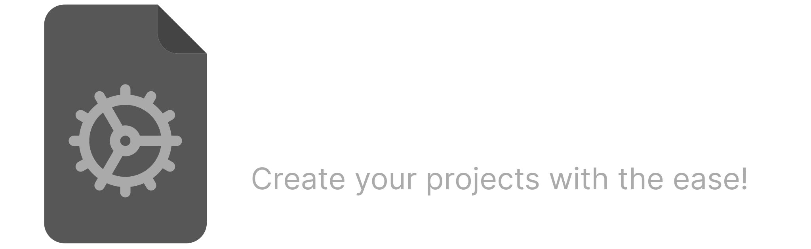
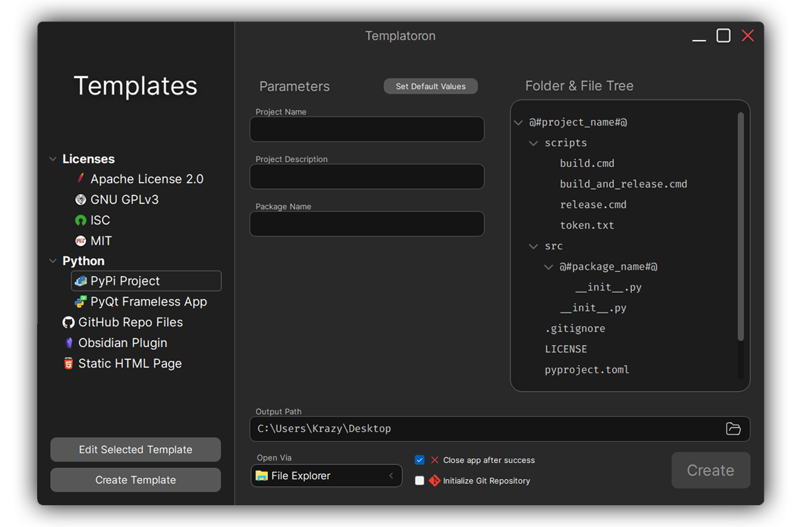

---

Every programmer or person using a computer for their work surely knows
the moment when they had an idea for an amazing project, but before they
managed to prepare the necessary files, libraries, etc. for their work, either
they forgot the idea or simply lost the desire to work on it.

But this time it is over with **Templatoron**! Application to create projects
from templates fast to enhance your workflow. Comes with minimalistic and easy interface to
use!

## Features

- [X] Create projects from templates
- [X] Input parameters to set up project the way you want
- [X] Open project via file explorer or one of the IDEs (Visual Studio Code, IntelliJ IDEA, PyCharm, ...)
- [X] Initialize Git Repository
- [X] Set default values for each templates, so you dont have to enter it again and again
- [ ] Create or edit templates

## ⚠️ Current Stage

This project is currently still in stage of development and it will be released when it will be ready and properly tested!